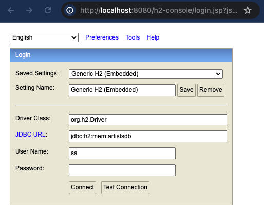
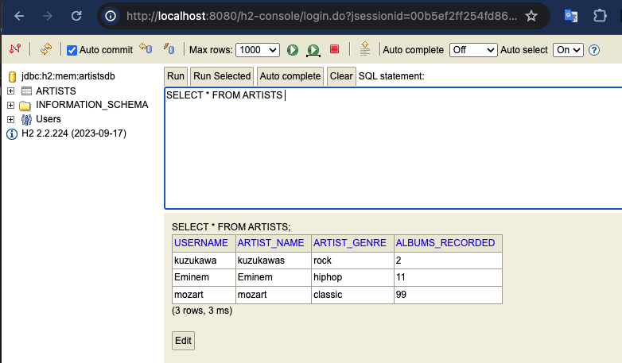

# OpenAPI 3.0 Tutorial をベースにSpring Bootでの開発環境を整える

[OpenAPI 3.0 Tutorial](https://support.smartbear.com/swaggerhub/docs/en/get-started/openapi-3-0-tutorial.html)を触って、OpenAPIによる書き方を勉強しよう。以降では、チュートリアルサイトに記載されている情報をまとめていく。最終的にはSpring Boot上でAPIのエンドポイントを開発できるようになるまでを目指す。

## 前書き

### OpenAPIとは何か
* APIの仕様をドキュメント化するための仕様
* 昔はSwagger Specificationと呼ばれていた
* 最新のバージョンはOpenAPI 3.0
* `JSON`か`YAML`で書けるが公式では`YAML`を推奨している

シンプルな OpenAPI 3.0仕様に従うと以下のようになる。
```yaml
openapi: 3.0.0
info:
  version: 1.0.0
  title: Sample API
  description: A sample API to illustrate OpenAPI concepts
paths:
  /list:
    get:
      description: Returns a list of stuff
      responses:
        '200':
          description: Successful response
```

### どこでコードを書くか。
* [SwaggerHub](https://app.swaggerhub.com/home)はWebブラウザだけで全ての作業が完結できるため、触ってみるには簡単でいい。
* [Visual Studio Code](https://code.visualstudio.com/)に[プラグイン](https://marketplace.visualstudio.com/items?itemName=42Crunch.vscode-openapi)を導入して使うのも良い。手元で全ての環境を構築することになるため、個人的にはこちらが推奨。

### 3つのメインセクション
OpenAPI Specificationでは以下の3つのメインセクションがある。各セクションの記載方法についてはチュートリアルを実施しながら説明する。
* Meta information
* Path items (endpoints):
  * Parameters
  * Request bodies
  * Responses
* Reusable components:
  * Schemas (data models)
  * Parameters
  * Responses
  * Other components

## OpenAPIチュートリアルに従って書いてみる。

### 作るAPIの概要
音楽のレコードレーベルのためのAPIを作る。以下の項目を持つアーティストのレコードを有する。
* Artist name
* Artist genre
* Number of albums published under the label
* Artist username

### Meta information
メタ情報には以下のような情報を書く。
* API title
* version
* server URL
* その他の説明

```yaml
openapi: 3.0.0
info:
  version: 1.0.0
  title: Simple Artist API
  description: A simple API to illustrate OpenAPIとは何か

servers:
  - url: https://example.io/v1

# Basic authentication
components:
  securitySchemes
    BasicAuth:
      type: http
      scheme: basic
security:
  - BasicAuth: []

paths: {}
```

#### 認証に関して
認証に関しては[こちら](https://swagger.io/docs/specification/authentication/)を参照。

### Path items
APIのエンドポイントのパス情報を書く。メタ情報で書いたサーバURLからの相対パスで表現する。今回は`/artists`と言うパスを用意するので、クライアントからは`GET https://example.io/v1/artists`と言うアドレスでAPIを呼び出すことになる。

```yaml
openapi: 3.0.0
info:
  version: 1.0.0
  title: Simple Artist API
  description: A simple API to illustrate OpenAPIとは何か

servers:
  - url: https://example.io/v1

# Basic authentication
components:
  securitySchemes
    BasicAuth:
      type: http
      scheme: basic
security:
  - BasicAuth: []

# ---------- Added lines -------------
paths: 
  /artists:
    get:
      description: Returns a list of artists
# ---------- /Added lines ------------
```

### Responses
`GET /artists`エンドポイントを呼び出すと、アーティストのリストを取得する。全てのHTTPレスポンスは少なくとも一つの(クライアントが結果を予想できる)HTTPステータスを返却する必要がある。今回は成功した場合は`200`を、失敗した場合は`400`を返却する。

#### メモ
* [HTTPステータスのリスト](https://www.restapitutorial.com/httpstatuscodes.html)
* [Responsesの書き方の詳細](https://swagger.io/docs/specification/describing-responses/)

```yaml
openapi: 3.0.0
info:
  version: 1.0.0
  title: Simple Artist API
  description: A simple API to illustrate OpenAPIとは何か

servers:
  - url: https://example.io/v1

# Basic authentication
components:
  securitySchemes
    BasicAuth:
      type: http
      scheme: basic
security:
  - BasicAuth: []

paths:
  /artists:
    get:
      description: Returns a list of artists
      # ---------- Added lines -------------
      responses:
        '200':
          description: Successfully returned a list of artists
          content:
            application/json:
              schema:
                type: array
                items:
                  type: object
                  required:
                    - username
                  properties:
                    artist_name:
                      type: string
                    artist_genre:
                      type: string
                    albums_recorded:
                      type: integer
                    username:
                      type: string
        '400':
          description: Invalid request
          content:
            application/json:
              schema:
                type: object
                  properties:
                    message:
                      type: string
        # ---------- /Added lines ------------
```

### Parameters
ユーザーが操作するリソースの可変部分を指定する。

#### メモ
* [パラメータの書き方の詳細](https://swagger.io/docs/specification/describing-parameters/)

#### Query parameters
以下のような取得件数の上限と、取得するページを指定できるクエリパラメータを考える。
```
GET https://example.io/v1/artists?limit=20&offset=3
```
`parameters:`を使って表現する。

```yaml
openapi: 3.0.0
info:
  version: 1.0.0
  title: Simple Artist API
  description: A simple API to illustrate OpenAPIとは何か

servers:
  - url: https://example.io/v1

# Basic authentication
components:
  securitySchemes
    BasicAuth:
      type: http
      scheme: basic
security:
  - BasicAuth: []

paths:
  /artists:
    get:
      description: Returns a list of artists
      # ---------- Added lines -------------
      parameters:
        - name: limit
          in: query
          description: Limits the number of items on a page
          schema:
            type: integer
        - name: offset
          in: query
          description: Specifies the page number of the artist to be displayed
          schema:
            type: integer
      # ---------- /Added lines ------------
      responses:
        '200':
          description: Successfully returned a list of artists
          content:
            application/json:
              schema:
                type: array
                items:
                  type: object
                  required:
                    - username
                  properties:
                    artist_name:
                      type: string
                    artist_genre:
                      type: string
                    albums_recorded:
                      type: integer
                    username:
                      type: string
        '400':
          description: Invalid request
          content:
            application/json:
              schema:
                type: object
                  properties:
                    message:
                      type: string
```

### Request body
`POST`, `PUT`, 'PATCH'メソッドのリクエストではリクエストボディが含まれる。リクエストボディは`requestBody`オブジェクトを使って表現する。`/artists`パスに`POST`リクエストを追加してみる。

```yaml
openapi: 3.0.0
info:
  version: 1.0.0
  title: Simple Artist API
  description: A simple API to illustrate OpenAPIとは何か

servers:
  - url: https://example.io/v1

# Basic authentication
components:
  securitySchemes
    BasicAuth:
      type: http
      scheme: basic
security:
  - BasicAuth: []

paths:
  /artists:
    get:
      description: Returns a list of artists
      parameters:
        - name: limit
          in: query
          description: Limits the number of items on a page
          schema:
            type: integer
        - name: offset
          in: query
          description: Specifies the page number of the artist to be displayed
          schema:
            type: integer
      responses:
        '200':
          description: Successfully returned a list of artists
          content:
            application/json:
              schema:
                type: array
                items:
                  type: object
                  required:
                    - username
                  properties:
                    artist_name:
                      type: string
                    artist_genre:
                      type: string
                    albums_recorded:
                      type: integer
                    username:
                      type: string
        '400':
          description: Invalid request
          content:
            application/json:
              schema:
                type: object
                properties:
                  message:
                    type: string
    # ---------- Added lines ------------
    post:
      description: Lets a user post a new artist
      requestBody:
        required: true
        content:
          application/json:
            schema:
              type: object
              required:
                - usename
              properties:
                artist_name:
                  type: string
                artist_genre:
                  type: string
                albums_recorded:
                  type: integer
                username:
                  type: string
      responses:
        '200':
          description: Successfully created a new artist
        '400':
          description: Invalid request
          content:
            application/json:
              schema:
                type: object
                properties:
                  message:
                    type: string
    # ---------- /Added lines ------------
```

### Path parameters
以下のようなアーティスト名を指定できるようなパスを考える。
```
https://example.io/v1/artists/{username}
```
このURLに対応する別のパスを追加する。
```yaml
openapi: 3.0.0
info:
  version: 1.0.0
  title: Simple Artist API
  description: A simple API to illustrate OpenAPIとは何か

servers:
  - url: https://example.io/v1

# Basic authentication
components:
  securitySchemes
    BasicAuth:
      type: http
      scheme: basic
security:
  - BasicAuth: []

paths:
  /artists:
    get:
      description: Returns a list of artists
      parameters:
        - name: limit
          in: query
          description: Limits the number of items on a page
          schema:
            type: integer
        - name: offset
          in: query
          description: Specifies the page number of the artist to be displayed
          schema:
            type: integer
      responses:
        '200':
          description: Successfully returned a list of artists
          content:
            application/json:
              schema:
                type: array
                items:
                  type: object
                  required:
                    - username
                  properties:
                    artist_name:
                      type: string
                    artist_genre:
                      type: string
                    albums_recorded:
                      type: integer
                    username:
                      type: string
        '400':
          description: Invalid request
          content:
            application/json:
              schema:
                type: object
                properties:
                  message:
                    type: string
    post:
      description: Lets a user post a new artist
      requestBody:
        required: true
        content:
          application/json:
            schema:
              type: object
              required:
                - usename
              properties:
                artist_name:
                  type: string
                artist_genre:
                  type: string
                albums_recorded:
                  type: integer
                username:
                  type: string
      responses:
        '200':
          description: Successfully created a new artist
        '400':
          description: Invalid request
          content:
            application/json:
              schema:
                type: object
                properties:
                  message:
                    type: string
  # ---------- Added lines ------------
  /artists/{username}:
    get:
      description: Obtain infomation about an artist from his or her unique username
      parameters:
        - name: username
          in: path
          required: true
          schema:
            type: string
      responses:
        '200':
          description: Successfully returned an artist
          content:
            application/json:
              schema:
                type: object
                properties:
                  artist_name:
                    type: string
                  artist_genre:
                    type: string
                  albums_recorded:
                    type: integer
        '400':
          description: Invalid request
          content:
            application/json:
              schema:
                type: object
                properties:
                  message:
                    type: string
  # ---------- /Added lines ------------
```
ここまでで、ひとまずAPIの設計は完了！おめでとうございます！

### Reusable components
ここまでで2つのエンドポイントと3つのアクションを設計した。同じレスポンスやスキーマについては `components`セクションにまとめよう。再利用なコンポーネントの種類は以下がある。
* Schemas (data models)
* Parameters
* Request bodies
* Responses
* Response headers
* Examples
* Links
* Callbacks

### Schemas
`HTTP 200`を返却する場合のレスポンスのスキーマを`components`にまとめてみよう。`securitySchemes`を定義するためにすでに`components`セクションは用意していたので、このタイミングで`components`セクションは末尾に移動する。

#### メモ
* [コンポーネントについての説明](https://swagger.io/docs/specification/components/)

```yaml
openapi: 3.0.0
info:
  version: 1.0.0
  title: Simple Artist API
  description: A simple API to illustrate OpenAPIとは何か

servers:
  - url: https://example.io/v1

security:
  - BasicAuth: []

paths:
  /artists:
    get:
      description: Returns a list of artists
      parameters:
        - name: limit
          in: query
          description: Limits the number of items on a page
          schema:
            type: integer
        - name: offset
          in: query
          description: Specifies the page number of the artist to be displayed
          schema:
            type: integer
      responses:
        '200':
          description: Successfully returned a list of artists
          content:
            application/json:
              schema:
                type: array
                items:
                  # ------------- Added Line -----------------
                  $ref: '#/components/schemas/Artist'
                  # ------------- /Added Line ----------------
'400':
          description: Invalid request
          content:
            application/json:
              schema:
                type: object
                properties:
                  message:
                    type: string
    post:
      description: Lets a user post a new artist
      requestBody:
        required: true
        content:
          application/json:
            schema:
              # ------------- Added Line -----------------
              $ref: '#/components/schemas/Artist'
              # ------------- /Added Line ----------------
      responses:
        '200':
          description: Successfully created a new artist
        '400':
          description: Invalid request
          content:
            application/json:
              schema:
                type: object
                properties:
                  message:
                    type: string
  /artists/{username}:
    get:
      description: Obtain infomation about an artist from his or her unique username
      parameters:
        - name: username
          in: path
          required: true
          schema:
            type: string
      responses:
        '200':
          description: Successfully returned an artist
          content:
            application/json:
              schema:
                type: object
                properties:
                  artist_name:
                    type: string
                  artist_genre:
                    type: string
                  albums_recorded:
                    type: integer
        '400':
          description: Invalid request
          content:
            application/json:
              schema:
                type: object
                properties:
                  message:
                    type: string

components:
  securitySchemes:
    BasicAuth:
      type: http
      scheme: basic

  # ---------- Added lines ------------
  schemas:
    Artist:
      type: object
      required:
        - username
      properties:
        artist_name:
          type: string
        artist_genre:
          type: string
        albums_recorded:
          type: integer
        username:
          type: string
  # ---------- /Added lines -----------
```

### Parameters and Responses
クエリパラメータ`offset`と`limit`と、`400Error`レスポンスについてもコンポーネント化してみる。

```yaml
openapi: 3.0.0
info:
  version: 1.0.0
  title: Simple Artist API
  description: A simple API to illustrate OpenAPIとは何か

servers:
  - url: https://example.io/v1

security:
  - BasicAuth: []

paths:
  /artists:
    get:
      description: Returns a list of artists
      parameters:
        - name: limit
          in: query
          description: Limits the number of items on a page
          schema:
            type: integer
        - name: offset
          in: query
          description: Specifies the page number of the artist to be displayed
          schema:
            type: integer
      responses:
        '200':
          description: Successfully returned a list of artists
          content:
            application/json:
              schema:
                type: array
                items:
                  $ref: '#/components/schemas/Artist'
        '400':
          # --------------- Added lines -------------------
          $ref: '#/components/responses/400Error'
          # --------------- /Added lines ------------------
    post:
      description: Lets a user post a new artist
      requestBody:
        required: true
        content:
          application/json:
            schema:
              $ref: '#/components/schemas/Artist'
      responses:
        '200':
          description: Successfully created a new artist
        '400':
          # --------------- Added lines -------------------
          $ref: '#/components/responses/400Error'
          # --------------- /Added lines ------------------
  /artists/{username}:
    get:
      description: Obtain infomation about an artist from his or her unique username
      parameters:
        - name: username
          in: path
          required: true
          schema:
            type: string
      responses:
        '200':
          description: Successfully returned an artist
          content:
            application/json:
              schema:
                type: object
                properties:
                  artist_name:
                    type: string
                  artist_genre:
                    type: string
                  albums_recorded:
                    type: integer
        '400':
          # --------------- Added lines -------------------
          $ref: '#/components/responses/400Error'
          # --------------- /Added lines ------------------
components:
  securitySchemes:
    BasicAuth:
      type: http
      scheme: basic

  schemas:
    Artist:
      type: object
      required:
        - username
      properties:
        artist_name:
          type: string
        artist_genre:
          type: string
        albums_recorded:
          type: integer
        username:
          type: string

  # --------------- Added lines -------------------
  parameters:
    PageLimit:
      name: limit
      in: query
      description: Limits the number of items on a page
      schema:
        type: integer

    PageOffset:
      name: offset
      in: query
      description: Specifies the page number of the artists to be displayed
      schema:
        type: integer

  responses:
    400Error:
      description: Invalid request
      content:
        application/json:
          schema:
            type: object
            properties:
              message:
                type: string
  # --------------- /Added lines ------------------
```

### サマリー
ここまでで基本は完了。基本的なRESTful APIの設計ができるようになった。ここから先は以下の公式ドキュメントを都度読んで勉強しよう。[SmartBear Academy](https://smartbear.com/academy/)にも色々な教材がある。
* [OpenAPI Specification](https://swagger.io/specification/)
* [Basic Structure](https://swagger.io/docs/specification/basic-structure/)

## HTML文書を生成する
今のままでは非エンジニアの方や文書としての成果物を他者と共有できないため、HTML文書を生成できるようにしていく。

### セットアップ
[redoc](https://github.com/Redocly/redoc)を導入する。
```shell
npm install -D redoc-cli
```

### HTML出力
以下のコマンドを実行してHTMLファイルを生成する。以下の例では`tutorial.html`としてHTML文書が生成される。
```shell
npx redoc-cli bundle tutorial.yaml --output tutorial.html
```


## Prismを利用したモックサーバを構築する
[Prism](https://stoplight.io/open-source/prism)はオープンソースのHTTPモックサーバ。

### インストール・セットアップ
以下のコマンドでPrismをインストールする。
```shell
npm install --save-dev @stoplight/prism-cli
```
次に`package.json`に実行のためのコマンドを追加する。
```json
  "scripts": {
    "run:mockserver": "prism mock ./tutorial.yaml"
  },
```
以下のコマンドを実行すると、OpenAPI定義に従ったMockサーバが起動する。
```shell
npm run run:mockserver
```
この状態で以下のコマンドを実行するとレスポンスが正しく取得できる。なお、以下コマンドで[httpie](https://httpie.io)を利用。
```shell
# GET /artists
http -a user:pass http://localhost:4010/artists

# GET /artists/1
http -a user:pass http://localhost:4010/artists/1

# POST /artists
http -a user:pass POST http://localhost:4010/artists artist_name=kuzukawa artist_genre=rock albums_recorded:=5 username=kuzukawa
```

### テストデータを改善する
今の状態だと以下のような適当な値が返却されてしまう。
```shell
❯ http -a user:pass http://localhost:4010/artists
HTTP/1.1 200 OK
Access-Control-Allow-Credentials: true
Access-Control-Allow-Headers: *
Access-Control-Allow-Origin: *
Access-Control-Expose-Headers: *
Connection: keep-alive
Content-Length: 90
Content-type: application/json
Date: Thu, 01 Feb 2024 11:58:52 GMT
Keep-Alive: timeout=5

[
    {
        "albums_recorded": 0,
        "artist_genre": "string",
        "artist_name": "string",
        "username": "string"
    }
]
```

Mockサーバ経由であっても適切な値を返却するよう、OpenAPI定義を修正する。`example`を利用することによりテストデータの値を定義することができる。

```yaml
openapi: 3.0.0
info:
  version: 1.0.0
  title: Simple Artist API
  description: A simple API to illustrate OpenAPIとは何か

servers:
  - url: https://example.io/v1

security:
  - BasicAuth: []

paths:
  /artists:
    get:
      description: Returns a list of artists
      parameters:
        - name: limit
          in: query
          description: Limits the number of items on a page
          schema:
            type: integer
        - name: offset
          in: query
          description: Specifies the page number of the artist to be displayed
          schema:
            type: integer
      responses:
        '200':
          description: Successfully returned a list of artists
          content:
            application/json:
              schema:
                type: array
                items:
                  $ref: '#/components/schemas/Artist'
        '400':
          $ref: '#/components/responses/400Error'
    post:
      description: Lets a user post a new artist
      requestBody:
        required: true
        content:
          application/json:
            schema:
              $ref: '#/components/schemas/Artist'
      responses:
        '200':
          description: Successfully created a new artist
        '400':
          $ref: '#/components/responses/400Error'
  /artists/{username}:
    get:
      description: Obtain infomation about an artist from his or her unique username
      parameters:
        - name: username
          in: path
          required: true
          schema:
            type: string
      responses:
        '200':
          description: Successfully returned an artist
          content:
            application/json:
              schema:
                type: object
                properties:
                  artist_name:
                    type: string
                  artist_genre:
                    type: string
                  albums_recorded:
                    type: integer
                example:
                  # ------ Added lines ------
                  artist_name: 'yamada'
                  artist_genre: 'pop'
                  albums_recorded: 989
                  # ------ /Added lines -----
        '400':
          $ref: '#/components/responses/400Error'
components:
  securitySchemes:
    BasicAuth:
      type: http
      scheme: basic

  schemas:
    Artist:
      type: object
      required:
        - username
      properties:
        artist_name:
          type: string
        artist_genre:
          type: string
        albums_recorded:
          type: integer
        username:
          type: string
      # --------------- Added lines -------------------
      example:
        artist_name: 'kuzukawa'
        artist_genre: 'rock'
        albums_recorded: 5
        username: 'kuzukawa'
      # --------------- /Added lines ------------------

  parameters:
    PageLimit:
      name: limit
      in: query
      description: Limits the number of items on a page
      schema:
        type: integer

    PageOffset:
      name: offset
      in: query
      description: Specifies the page number of the artists to be displayed
      schema:
        type: integer

  responses:
    400Error:
      description: Invalid request
      content:
        application/json:
          schema:
            type: object
            properties:
              message:
                type: string
```
ここまでで、Prismを利用したMockサーバ上での動作までができるようになった。この先、フロントエンド開発を進めていくようであれば以降の章は確認不要。以降では、Spring Bootを利用してバックエンドを実装していく。

## Spring Bootの開発環境を用意する

### 環境の導入と疎通確認
まずは[Spring initializr](https://start.spring.io/#!type=gradle-project&language=java&platformVersion=3.2.2&packaging=jar&jvmVersion=21&groupId=net.kuzukawa.api&artifactId=artist&name=artist&description=Artist%20API%20project%20for%20Spring%20Boot&packageName=net.kuzukawa.api.artist)で雛形を作成する。zipファイルをダウンロードし、`backend`ディレクトリを用意して資材を展開する。次に、最低限動くかを確認するために手で`Controller`を作成し、起動確認を行う。

#### `build.gradle`を修正して依存関係を追加する
初期状態では最低限の依存関係しか定義していないため、Webアプリケーションの開発ができない。`build.gradle`に以下の定義を追加し、Webアプリケーションの開発ができるよう、依存関係を追加する。

```gradle
dependencies {
	implementation 'org.springframework.boot:spring-boot-starter'
  // ----------- Add line --------------
  implementation 'org.springframework.boot:spring-boot-starter-web'
  // ----------- /Add line -------------
  testImplementation 'org.springframework.boot:spring-boot-starter-test'
}
```

次に、疎通用の`@RestController`として`net.kuzukawa.api.artist.controller.HelloController.java`を作成する。
```java
package net.kuzukawa.api.artist.controller;

import org.springframework.boot.autoconfigure.*;
import org.springframework.web.bind.annotation.GetMapping;
import org.springframework.web.bind.annotation.RestController;

@RestController
@EnableAutoConfiguration
public class HelloController {
  @GetMapping("/")
  String home(){
    return "Hello world";
  }
}
```
この状態で以下のコマンドを実行してSpringBootアプリケーションを起動して疎通確認を行う。
* サーバ起動
```shell
./gradlew bootRun
```
* 疎通確認
```shell
❯ http http://localhost:8080
HTTP/1.1 200 
Connection: keep-alive
Content-Length: 11
Content-Type: text/plain;charset=UTF-8
Date: Thu, 01 Feb 2024 14:13:52 GMT
Keep-Alive: timeout=60

Hello world
```

ここまでで、SpringBootの初期セットアップおよび疎通確認が完了できた。

## OpenAPI Generatorを利用したAPIエンドポイントのコード自動生成
OpenAPI Generatorを利用してSpring Boot用のAPIエンドポイントのコードを生成してみる。

### Gradleのセットアップ
[OpenAPI Generator Gradle Plugin](https://github.com/OpenAPITools/openapi-generator/tree/master/modules/openapi-generator-gradle-plugin)を適用する。`build.gradle`にpluginを追加する。

```gradle
plugins {
	id 'java'
	id 'org.springframework.boot' version '3.2.2'
	id 'io.spring.dependency-management' version '1.1.4'
  // --------------- Added lines -------------------
	id 'org.openapi.generator' version '7.2.0'
  // --------------- /Added lines ------------------
}
```

### 自動生成される資産の取り扱い
自動生成される資産はGradleのビルドディレクトリとする。
* ビルドディレクトリは`.gitignore`対象とするためリポジトリの管理対象外となる
* 自動生成されるファイルは手動での改変は許可してはならない
* 自動生成される資産は`build/generated`以下とする
* `interface`のみを生成することも`Controller`も生成することもできる(Generation Gapパターン)

#### Generation Gapパターンに関して
インターフェイスだけ生成するやり方と`Controller`も自動生成してしまいその具体処理をサービスとして移譲する、という方法がある。Generation Gapパターンはコードを自動生成する前提のデザインパターンだが、自動生成した資産を手動で修正してしまうと、再度自動生成する必要がある場合に手動修正した部分が失われてしまい、使いづらい。Generation Gapパターンでは継承を使ってその問題を解決する。簡単に整理すると以下の通り。
* 自動生成時はスーパークラスのコードを生成
* 開発者はそのサブクラスだけを実装
* インスタンス化するのはサブクラスだけ
* サブクラスではスーパークラスのメソッドを継承したり、オーバーライドしたりする
* 自動生成されるコード側ではサブクラスから使うインターフェイスは変更しない
* 自動生成されるコード側ではTemplate Methodの部分も変えない

##### 参考リンク
* 参考：[Generation Gapパターン](https://www.hyuki.com/dp/dpinfo.html#GenerationGap)
* 参考：[OpenAPI Generatorを使ったコードの自動生成とインターフェイスの守り方](https://zenn.dev/angelica/articles/3b7ac906f73638)

#### 問題点

ただし、現状構成では生成されるコードに不具合が含まれるため、一旦このタイミングではGeneration Gapパターンは利用せずに、Interface Onlyの設定で作業を進める。


### `gradle.build`に自動生成の設定を追加
```groovy
plugins {
	id 'java'
	id 'org.springframework.boot' version '3.2.2'
	id 'io.spring.dependency-management' version '1.1.4'
	id 'org.openapi.generator' version '7.2.0'
}

group = 'net.kuzukawa.api'
version = '0.0.1-SNAPSHOT'

java {
	sourceCompatibility = '21'
}

repositories {
	mavenCentral()
}

dependencies {
	implementation 'org.springframework.boot:spring-boot-starter'
  implementation 'org.springframework.boot:spring-boot-starter-web'
  // ----------------- Added lines --------------------
	implementation 'org.springframework.data:spring-data-commons'
	implementation 'org.springdoc:springdoc-openapi-starter-webmvc-ui:2.3.0'
	implementation 'com.google.code.findbugs:jsr305:3.0.2'
	implementation 'com.fasterxml.jackson.dataformat:jackson-dataformat-yaml'
	implementation 'com.fasterxml.jackson.datatype:jackson-datatype-jsr310'
	implementation 'org.openapitools:jackson-databind-nullable:0.2.6'

  implementation 'org.springframework.boot:spring-boot-starter-validation'
	implementation 'com.fasterxml.jackson.core:jackson-databind'
  // ----------------- /Added lines -------------------
  testImplementation 'org.springframework.boot:spring-boot-starter-test'
}

tasks.named('test') {
	useJUnitPlatform()
}

// ----------------- Added lines --------------------
openApiGenerate {
	generatorName = "spring"
	//inputSpec = "$rootDir/specs/petstore.yaml".toString()
	inputSpec = "../tutorial.yaml".toString()
	outputDir = layout.buildDirectory.dir("generated").get().asFile.path
	apiPackage = "net.kuzukawa.api.artist.api"
	invokerPackage = "net.kuzukawa.api.artist.invoker"
	modelPackage = "net.kuzukawa.api.artist.model"
	generateModelTests = false
	generateApiTests = false
	generateModelDocumentation = false
	generateApiDocumentation = false
	// https://openapi-generator.tech/docs/generators/spring
	configOptions = [
			dataLibrary          : "java8",
			documentationProvider: "springdoc",
			interfaceOnly : "true",　　　　  // Generation Gapパターン利用のための設定(左記はinterface onlyの設定)
			delegatePattern : "false",　　　// Generation Gapパターン利用のための設定(左記はinterface onlyの設定)
			skipDefaultInterface : "true",
			useSpringBoot3 : "true",
			useJakartaEe : "true",
	]
}

compileJava.dependsOn tasks.openApiGenerate

sourceSets {
	main {
		java {
			srcDir "${openApiGenerate.outputDir.get()}/src/main/java"
		}
	}
}
// ----------------- /Added lines -------------------
```

### 自動生成＆ビルド
以下のコマンドを実行して自動生成された資産のビルドを行う。以下のコマンドを実行してエラーが発生なければ、OpenAPI Generatorを利用した資産の自動生成・ビルドは成功している。

```shell
# 自動生成
./gradlew openApiGenerate

# ビルド
./gradlew build
```

### `OperationId`を定義する
今の定義だと、各エンドポイントに対応するメソッド名が以下のように自動生成されるため、可読性に懸念がある。以下はGradle実行時の警告メッセージ。

```shell
Empty operationId found for path: GET /artists. Renamed to auto-generated operationId: artistsGET
Empty operationId found for path: POST /artists. Renamed to auto-generated operationId: artistsPOST
Empty operationId found for path: GET /artists/{username}. Renamed to auto-generated operationId: artistsUsernameGET
Empty operationId found for path: get /artists. Renamed to auto-generated operationId: artistsGet
Empty operationId found for path: post /artists. Renamed to auto-generated operationId: artistsPost
Empty operationId found for path: get /artists/{username}. Renamed to auto-generated operationId: artistsUsernameGet
```

OpenAPI定義を修正して適切なメソッド名で資産が生成されるように修正する。

```yaml
openapi: 3.0.0
info:
  version: 1.0.0
  title: Simple Artist API
  description: A simple API to illustrate OpenAPIとは何か

servers:
  - url: https://example.io/v1

security:
  - BasicAuth: []

paths:
  /artists:
    get:
      description: Returns a list of artists
      # -------------- Added lines ----------------
      operationId: getArtists
      # -------------- /Added lines ---------------
      parameters:
        - name: limit
          in: query
          description: Limits the number of items on a page
          schema:
            type: integer
        - name: offset
          in: query
          description: Specifies the page number of the artist to be displayed
          schema:
            type: integer
      responses:
        '200':
          description: Successfully returned a list of artists
          content:
            application/json:
              schema:
                type: array
                items:
                  $ref: '#/components/schemas/Artist'
        '400':
          $ref: '#/components/responses/400Error'
    post:
      description: Lets a user post a new artist
      # -------------- Added lines ----------------
      operationId: registArtist
      # -------------- /Added lines ---------------
      requestBody:
        required: true
        content:
          application/json:
            schema:
              $ref: '#/components/schemas/Artist'
      responses:
        '200':
          description: Successfully created a new artist
        '400':
          $ref: '#/components/responses/400Error'
  /artists/{username}:
    get:
      description: Obtain infomation about an artist from his or her unique username
      # -------------- Added lines ----------------
      operationId: getArtist
      # -------------- /Added lines ---------------
      parameters:
        - name: username
          in: path
          required: true
          schema:
            type: string
      responses:
        '200':
          description: Successfully returned an artist
          content:
            application/json:
              schema:
                type: object
                properties:
                  artist_name:
                    type: string
                  artist_genre:
                    type: string
                  albums_recorded:
                    type: integer
                example:
                  artist_name: 'yamada'
                  artist_genre: 'pop'
                  albums_recorded: 989
        '400':
          $ref: '#/components/responses/400Error'
components:
  securitySchemes:
    BasicAuth:
      type: http
      scheme: basic

  schemas:
    Artist:
      type: object
      required:
        - username
      properties:
        artist_name:
          type: string
        artist_genre:
          type: string
        albums_recorded:
          type: integer
        username:
          type: string
      example:
        artist_name: 'kuzukawa'
        artist_genre: 'rock'
        albums_recorded: 5
        username: 'kuzukawa'

  parameters:
    PageLimit:
      name: limit
      in: query
      description: Limits the number of items on a page
      schema:
        type: integer

    PageOffset:
      name: offset
      in: query
      description: Specifies the page number of the artists to be displayed
      schema:
        type: integer

  responses:
    400Error:
      description: Invalid request
      content:
        application/json:
          schema:
            type: object
            properties:
              message:
                type: string
```

改めてコードを自動生成しておく。

```shell
# 自動生成
./gradlew openApiGenerate
```

## 生成されたコードを元にAPIを実装する

### [Lombok](https://projectlombok.org/)を導入しておく
言わずもがな`Setter`や`Getter`を自動生成するライブラリ。利用可能な機能の一覧は[こちら](https://projectlombok.org/features/)を参照。

```groovy
dependencies {
	implementation 'org.springframework.boot:spring-boot-starter'
  implementation 'org.springframework.boot:spring-boot-starter-web'
	implementation 'org.springframework.data:spring-data-commons'
	implementation 'org.springdoc:springdoc-openapi-starter-webmvc-ui:2.3.0'
	implementation 'com.google.code.findbugs:jsr305:3.0.2'
	implementation 'com.fasterxml.jackson.dataformat:jackson-dataformat-yaml'
	implementation 'com.fasterxml.jackson.datatype:jackson-datatype-jsr310'
	implementation 'org.openapitools:jackson-databind-nullable:0.2.6'

  implementation 'org.springframework.boot:spring-boot-starter-validation'
	implementation 'com.fasterxml.jackson.core:jackson-databind'

  // ----------------- Added lines --------------------
	compileOnly 'org.projectlombok:lombok:1.18.30'
	annotationProcessor 'org.projectlombok:lombok:1.18.30'

	testCompileOnly 'org.projectlombok:lombok:1.18.30'
	testAnnotationProcessor 'org.projectlombok:lombok:1.18.30'
  // ----------------- /Added lines -------------------
  testImplementation 'org.springframework.boot:spring-boot-starter-test'
}
```


### APIのエンドポイントを実装する

とりあえず、Interface OnlyパターンでAPIのエンドポイントを実装してみよう。自動生成された`ArtistsApi`を継承した`@RestController`を実装すれば良い。ここでは、`net.kuzukawa.api.artist.controller.ArtistApiController.java`を新規作成する。なお、以下は疎通確認用のサンプルであるため、データは全てハードコーディングしている。

```java
package net.kuzukawa.api.artist.controller;

import java.util.ArrayList;
import java.util.List;

import org.springframework.http.HttpStatus;
import org.springframework.http.ResponseEntity;
import org.springframework.web.bind.annotation.RestController;

import jakarta.validation.Valid;
import net.kuzukawa.api.artist.api.ArtistsApi;
import net.kuzukawa.api.artist.model.Artist;
import net.kuzukawa.api.artist.model.GetArtistByUsername200Response;

@RestController
public class ArtistApiController implements ArtistsApi {
  @Override
  public ResponseEntity<GetArtistByUsername200Response> getArtistByUsername(String username) {
    GetArtistByUsername200Response response = new GetArtistByUsername200Response()
      .artistName("test musician1")
      .artistGenre("rock")
      .albumsRecorded(4);

      return new ResponseEntity<>(
        response,
        HttpStatus.OK
      );
  }

  @Override
  public ResponseEntity<List<Artist>> getArtists(@Valid Integer limit, @Valid Integer offset) {
    List<Artist> response = new ArrayList<Artist>();
    response.add(new Artist()
      .artistName("List Musician 1")
      .artistGenre("rock")
      .albumsRecorded(1)
      .username("List Musician 1"));

      response.add(new Artist()
      .artistName("List Musician 2")
      .artistGenre("jazz")
      .albumsRecorded(2)
      .username("List Musician 2"));

      response.add(new Artist()
      .artistName("List Musician 3")
      .artistGenre("classic")
      .albumsRecorded(3)
      .username("List Musician 3"));

      return new ResponseEntity<>(
        response,
        HttpStatus.OK
      );
    }

  @Override
  public ResponseEntity<Void> postArtist(@Valid Artist artist) {
    //insert logic
    return new ResponseEntity<>(
      null,
      HttpStatus.OK
    );
  }
}

```


### APIを実行してみる

* サーバを起動する

```shell
./gradlew bootRun
```

* 各種疎通確認

  * `GET /artists`

    ```shell
    ❯ http http://localhost:8080/artists                                         ✘ 1 
    HTTP/1.1 200 
    Connection: keep-alive
    Content-Type: application/json
    Date: Sun, 25 Feb 2024 11:33:42 GMT
    Keep-Alive: timeout=60
    Transfer-Encoding: chunked
    
    [
        {
            "albums_recorded": 1,
            "artist_genre": "rock",
            "artist_name": "List Musician 1",
            "username": "List Musician 1"
        },
        {
            "albums_recorded": 2,
            "artist_genre": "jazz",
            "artist_name": "List Musician 2",
            "username": "List Musician 2"
        },
        {
            "albums_recorded": 3,
            "artist_genre": "classic",
            "artist_name": "List Musician 3",
            "username": "List Musician 3"
        }
    ]
    ```

  * `GET /artists/username`

    ```shell
    ❯ http http://localhost:8080/artists/username
    HTTP/1.1 200 
    Connection: keep-alive
    Content-Type: application/json
    Date: Sun, 25 Feb 2024 11:34:20 GMT
    Keep-Alive: timeout=60
    Transfer-Encoding: chunked
    
    {
        "albums_recorded": 4,
        "artist_genre": "rock",
        "artist_name": "test musician1"
    }
    ```

  * `POST /artists`

    ```shell
    ❯ http post http://localhost:8080/artists artist_name="Rock Musician" artist_genre="rock" albums_recorded:=3 username="Rock Musician"
    HTTP/1.1 200 
    Connection: keep-alive
    Content-Length: 0
    Date: Sun, 25 Feb 2024 11:34:54 GMT
    Keep-Alive: timeout=60
    ```

上記により、全ての実装したAPIのエンドポイントが疎通できた。ここまでで、以下の対応が完了した。

* OpenAPI Generatorを利用してJavaコードの自動生成を行い
* 自動生成されたコードを継承した`@RestController`を実装し、
* HTTPクライアントから疎通確認を行う。


## ローカル開発できるDB環境を構築しよう

ローカル環境でDBを利用した開発をできるようにしていく。コンセプトは以下の通り。
* 手元で簡単に開発することを目的として[H2 Database Engine](https://www.h2database.com/html/main.html)を利用する
* JavaからのDBアクセスは[Java Persistense API(JPA)](https://ja.wikipedia.org/wiki/Java_Persistence_API)を利用する

### H2 Database Engineの導入
`build.grale`に依存関係を追加する。

```groovy
dependencies {
	implementation 'org.springframework.boot:spring-boot-starter'
  implementation 'org.springframework.boot:spring-boot-starter-web'
	implementation 'org.springframework.data:spring-data-commons'
	implementation 'org.springdoc:springdoc-openapi-starter-webmvc-ui:2.3.0'
	implementation 'com.google.code.findbugs:jsr305:3.0.2'
	implementation 'com.fasterxml.jackson.dataformat:jackson-dataformat-yaml'
	implementation 'com.fasterxml.jackson.datatype:jackson-datatype-jsr310'
	implementation 'org.openapitools:jackson-databind-nullable:0.2.6'

  implementation 'org.springframework.boot:spring-boot-starter-validation'
	implementation 'com.fasterxml.jackson.core:jackson-databind'

	compileOnly 'org.projectlombok:lombok:1.18.30'
	annotationProcessor 'org.projectlombok:lombok:1.18.30'

	testCompileOnly 'org.projectlombok:lombok:1.18.30'
	testAnnotationProcessor 'org.projectlombok:lombok:1.18.30'

  testImplementation 'org.springframework.boot:spring-boot-starter-test'

  // ----------- Add line --------------
	compileOnly("jakarta.persistence:jakarta.persistence-api:3.1.0")
	implementation 'org.springframework.boot:spring-boot-starter-data-jpa'
	runtimeOnly 'com.h2database:h2'
  // ----------- /Add line -------------
}
```
次に設定ファイルを修正する。環境ごとに設定ファイルを分けて用意した方が良いので、以下の構造で設定ファイルと初期データファイルを用意する。
```shell
backend
└── src
    └── main
        └── resources
            ├── application-common.yml # 共通設定ファイル
            ├── application-local.yml  # ローカル環境用設定ファイル
            ├── application.yml        # 大本の環境設定ファイル
            ├── data.sql               # データファイル(DML)
            └── schema.sql             # テーブル情報(DDL)
```
各設定ファイルの記載内容は以下の通り。
* `application.yml`
  ```yaml
  spring:
  profiles:
    group:
      local:
        - common
        - local
  ```
* `application-common.yml`
  ```yaml
  //NOP(今の所空ファイル)
  ```
* `application-local.yml`
  ```yaml
  spring:
  datasource:
    driver-class-name: org.h2.Driver
    url: jdbc:h2:mem:artistsdb
    username: sa
    password:
  h2:
    console:
      enabled: true
      path: /h2-console
  sql:
    init:
      mode: always
  ```
ここまでで、SpringBootアプリケーションからH2Databaseに接続するところまでの設定が完了した。JPAを利用することにより、本番環境で異なるDBを利用する場合でも `driver-class-name`を差し替えればそのまま動作する！という戦略。

### データファイルを準備する
H2 Databaseは上記設定では揮発性DB(プロセスが終了したらデータも全て失われる)となっている。そのため、アプリケーション起動のたびにDBのセットアップ(テーブル作成、データ投入)を行わなければならない。以下の通り、それぞれスキーマとデータを準備しよう。

* `schema.sql`
```sql
DROP TABLE IF EXISTS ARTISTS;

CREATE TABLE ARTISTS (
    USERNAME VARCHAR(255) NOT NULL PRIMARY KEY,
    ARTIST_NAME VARCHAR(255) NOT NULL,
    ARTIST_GENRE VARCHAR(255) NOT NULL,
    ALBUMS_RECORDED INT NOT NULL
);
```

* `data.sql`
```sql
INSERT INTO ARTISTS VALUES ('kuzukawa', 'kuzukawas','rock',2);
INSERT INTO ARTISTS VALUES ('Eminem', 'Eminem','hiphop',11);
INSERT INTO ARTISTS VALUES ('mozart', 'mozart','classic',99);
```

### `spring.jpa.hibernate.ddl-auto`の見直し
この設定をうまく使うとコードを元にデータベーススキーマを生成することができる。ただし、今回はすでにDDLを作成してしまっているので、この機能は無効化しておく。（詳細な原因は調査していないが、この設定を明記しないと、何らかのDDL作成処理が動いてしまい、テーブルは構築されるものの初期データがセットされない、という事象が発生した。おそらく、H2がテーブル作成・初期データロードしたのちに、hibernateがテーブルを再作成してしまっているものと思われる。

本設定は今回は環境を問わず設定したいので、`application.yml`に以下の設定を追加する。

```yaml
spring:
  // ----------- Add line --------------
  jpa:
    hibernate:
      ddl-auto: none
  // ----------- Add line --------------
  group:
    local:
      - common
      - local
```

### アプリケーション起動
この状態でアプリケーションを起動するとDBも合わせて起動され、アプリケーションからDBが参照できるようになる。SpringBootのprofile機能を利用することになるため、Gradle経由でアプリケーションを起動する場合は以下のようにして起動する。

```shell
./gradlew bootRun --args='--spring.profiles.active=local'
```

### DBの確認
起動したらブラウザを利用して以下のURLを参照してみる。
```shell
http://localhost:8080/h2-console
```
以下のようなログイン画面が表示できたら、無事にH2 Database Engineは起動できていることになる。



初期データも以下のようにロードされていれば問題なし。




## JPAを利用したデータベースアクセス
ここまできたら最後のステップ。JPAを利用してJavaのコードからH2 Database Engineにアクセスしてみよう。

### 依存関係の追加
前のステップで追加していたが、以下がJPAに関連する依存関係。

```groovy
dependencies {
　.
　.
	compileOnly("jakarta.persistence:jakarta.persistence-api:3.1.0")
	implementation 'org.springframework.boot:spring-boot-starter-data-jpa'
　.
　.
}
```

### Javaのコードを実装していく
とりあえず、`/artists/{username}` エンドポイントを実装してみよう。このAPIはプライマリキーを受け取って1レコード取得し、レスポンスとして返却するサービスである。

#### @Entity
`java.net.kuzukawa.api.artist.entity.ArtistsEntity.java`を作成する。
```java
package net.kuzukawa.api.artist.entity;

import jakarta.persistence.*;
import lombok.*;

@AllArgsConstructor
@Builder
@Data
@Entity
@NoArgsConstructor
@ToString
@Table(name = "artists")
public class ArtistsEntity {
    @Id
    @Column(name = "username", nullable = false, updatable = true)
    private String username;

    @Column(name = "artist_name", nullable = false, length = 255)
    private String artistName;

    @Column(name = "artist_genre", nullable = false, length = 255)
    private String artistGenre;

    @Column(name = "albums_recorded", nullable = false)
    private int albumsRecorded;
}
```

#### @Repository
`java.net.kuzukawa.api.artist.repository.ArtistsRepository.java`を作成する。
```java
package net.kuzukawa.api.artist.repository;

import net.kuzukawa.api.artist.entity.ArtistsEntity;
import org.springframework.data.jpa.repository.JpaRepository;
import org.springframework.lang.NonNull;
import org.springframework.stereotype.Repository;

import java.util.Optional;

@Repository
public interface ArtistsRepository extends JpaRepository<ArtistsEntity, String> {
    @NonNull
    Optional<ArtistsEntity> findById(@NonNull final String username);
}
```

#### @Service
`java.net.kuzukawa.api.artist.service.ArtistsApiService.java`を作成する。
```java
package net.kuzukawa.api.artist.service;

import net.kuzukawa.api.artist.entity.ArtistsEntity;
import net.kuzukawa.api.artist.repository.ArtistsRepository;
import org.springframework.lang.NonNull;
import org.springframework.stereotype.Service;

import java.util.Optional;

@Service
public class ArtistsApiService {
  private final ArtistsRepository artistsRepository;

  public ArtistsApiService(@NonNull final ArtistsRepository artistsRepository) {
      this.artistsRepository = artistsRepository;
  }

  @NonNull
  public Optional<ArtistsEntity> getById(@NonNull final String username) {
      return artistsRepository.findById(username);
  }
}
```

#### @Controller
`java.net.kuzukawa.api.artist.controller.ArtistApiController.java`を修正する。今回は`artists/{username}に該当するメソッドだけを修正する。
```java
  @Override
  public ResponseEntity<GetArtistByUsername200Response> getArtistByUsername(String username) {
    Optional<ArtistsEntity> oArtistsEntity = artistsApiService.getById(username);
    if(oArtistsEntity.isEmpty()) {
      return new ResponseEntity<>(HttpStatus.NOT_FOUND);
    }
    final ArtistsEntity artistsEntity = oArtistsEntity.get();
    GetArtistByUsername200Response response = new GetArtistByUsername200Response()
      .artistName(artistsEntity.getArtistName())
      .artistGenre(artistsEntity.getArtistGenre())
      .albumsRecorded(artistsEntity.getAlbumsRecorded());

    return new ResponseEntity<>(
            response,
            HttpStatus.OK);
  }
```

ここまででJavaの実装は完了。

### サーバ起動と疎通確認
* サーバ起動
```shell
./gradlew bootRun -Dprofiles.active=local
```

* 疎通確認
```shell
❯ http localhost:8080/artists/Eminem
HTTP/1.1 200 
Connection: keep-alive
Content-Type: application/json
Date: Sun, 03 Mar 2024 08:40:27 GMT
Keep-Alive: timeout=60
Transfer-Encoding: chunked

{
    "albums_recorded": 11,
    "artist_genre": "hiphop",
    "artist_name": "Eminem"
}
```
無事に初期データをAPI経由で取得することができた。

## 今後のやること
時間があれば、残りのエンドポイントの実装も追記していきます！！

## その他参考になるメモ

### 参考リンク

* [OpenAPI Generatorに適したOpenAPIの書き方](https://techblog.zozo.com/entry/how-to-write-openapi-for-openapi-generator)

